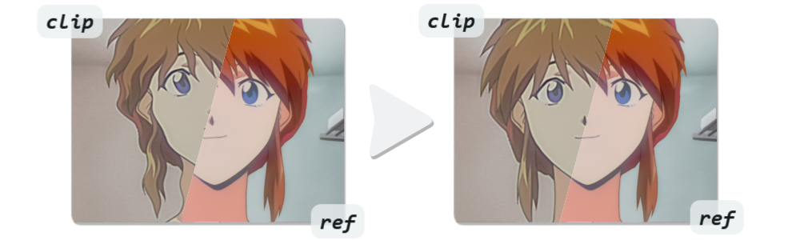
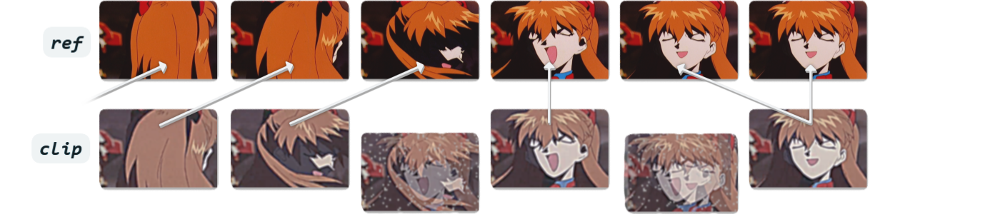

# Video Alignment and Synchronization for Vapoursynth
Useful when two sources are available and you would like to combine them in certain ways, which would only become possible once they are perfectly aligned and synchronized. For example, transferring colors or textures, patching crushed areas, creating paired datasets, combining high res Blu-ray chroma with better DVD luma, or similar.

### Requirements
* [pytorch with cuda](https://pytorch.org/)
* `pip install opencv-python`
* `pip install numpy`
* `pip install timm` *(optional, only for Temporal Alignment Precision 3)*
* [julek-plugin](https://github.com/dnjulek/vapoursynth-julek-plugin) *(optional, only for Temporal Alignment Precision 2 on CPU)*
* [vship](https://github.com/Line-fr/Vship) *(optional, only for Temporal Alignment Precision 2 on GPU)*

### Setup
Put the entire `vs_align` folder into your vapoursynth scripts folder.  
Or install via pip: `pip install git+https://github.com/pifroggi/vs_align.git`

<br />

## Spatial Alignment
Aligns and removes distortions by warping a frame towards a reference frame. See this collection of [Comparisons](https://slow.pics/c/T71U8Ewk) and this one for [Mask Usage](https://slow.pics/c/JsQfwdhF). 
<p align="center">
  <a href="https://slow.pics/c/T71U8Ewk">
    
  </a>
</p>

```python
import vs_align
clip = vs_align.spatial(clip, ref, mask=None, precision=3, wide_search=False, lq_input=False, device="cuda")
```

__*`clip`*__  
Misaligned clip. Must be in RGB format.

__*`ref`*__  
Reference clip that misaligned clip will be aligned to. Output will have these dimensions. Must be in RGB format.

__*`mask`* (optional)__  
Black & white mask clip where white excludes areas from warping, like a watermark or text that is only on one clip. Masked areas will instead be warped like the surroundings. Can be a static single frame or a moving mask.  
Can be any format and dimensions. The position of masked areas are based on the ref clip.

__*`precision`*__  
Speed/Quality tradeoff in the range 1-4, with higher meaning more exact and stable alignment up to a subpixel level. Higher is slower and requires more VRAM. 2 or 3 works great in most cases.

__*`wide_search`* (optional)__  
Enables a larger search radius at the cost of speed. When set to True completely different crops like 4:3 and 16:9, shearing, and rotations up to 45° can be aligned. Recommended if the misalignment is larger than about 20 pixel.

__*`lq_input`* (optional)__  
Enables better handling for low-quality input clips. When set to True general shapes are prioritized over high-frequency details like noise, grain, or compression artifacts by averaging the warping across a small area. Also fixes an issue sometimes noticeable in 2D animation, where lines can get slightly thicker/thinner due to warping.

__*`device`* (optional)__  
Can be "cpu", or "cuda" for use with an Nvidia GPU. This will be very slow on CPU.

> [!TIP]
> __Alignment Quality:__ While this is good at aligning very different looking clips ([see comparisons](https://slow.pics/c/T71U8Ewk)), you will make it easier and get better results by prefiltering to make ref as close to clip as possible. For example:
> - Always crop black borders.
> - If clip has vastly different brightness or colors, make ref roughly match.

> [!TIP]
> __Usage without Vapoursynth:__ Now also usable in the image processing program chaiNNer via the "Align Image to Reference" node. Needed is the [nightly build](https://github.com/chaiNNer-org/chaiNNer-nightly/releases/) 2025-03-12 or newer.

<br />

## Temporal Alignment
Synchronizes a clip with a reference clip by frame matching. It works by searching through a clip and finding the frame that most closely matches the reference clip frame. Sometimes also known as automatic frame remapping.
<p align="center">
  
</p>

```python
import vs_align
clip = vs_align.temporal(clip, ref, out=None, tr=20, precision=1, fallback=None, thresh=100.0, clip_num=None, clip_den=None, ref_num=None, ref_den=None, batch_size=None, device="cuda", debug=False)
```

__*`clip`*__  
Unsynched clip. Must be same format and dimensions as ref.

__*`ref`*__  
Reference clip that unsynched clip will be synched to. Must be same format and dimensions as clip.

__*`out`* (optional)__  
Output clip from which matched frames are copied. By default, frames are matched and copied from clip. However, if providing an out clip, the script will still use clip and ref for frame matching but will copy the actual frames in the final output from out. A common use case is downscaling clip and ref for faster matching while preserving the original high res frames in the output. Can be any format and dimensions.

__*`precision`*__  
| # | Precision | Speed     | Use case                                                            | Method
| - | --------- | --------- | ------------------------------------------------------------------- | ------
| 1 | Worst     | Very Fast | Clips are visually identical, but frames are out of order.          | [PlaneStats](https://www.vapoursynth.com/doc/functions/video/planestats.html)
| 2 | Better    | Slow      | Slight differences like compression, grain, halos, blurriness.      | [Butteraugli](https://github.com/dnjulek/vapoursynth-julek-plugin/wiki/Butteraugli)
| 3 | Best      | Slow      | Large differences like warping, colors, small spatial misalignment. | [TOPIQ](https://github.com/chaofengc/IQA-PyTorch/blob/main/pyiqa/archs/topiq_arch.py)

__*`tr`*__  
Temporal radius determines how many frames to search forwards and backwards for a match. Higher is slower.

__*`fallback`* (optional)__  
Fallback clip in case no good match is found. Must have the same format and dimensions as clip (or out if used).

__*`thresh`* (optional)__  
Threshold for fallback clip. If frames differ more than this value, fallback clip is used. Use `debug=True` to get an idea for the values. The ranges differ for each precision value. Does nothing if no fallback clip is set.

__*`clip_num`, `clip_den`, `ref_num`, `ref_den`* (optional)__   
Numerator and Denominator for clip and ref. Only needed if clip and ref have different framerates. This is used to make sure the function searches for a matching frame in the correct location.  
Example with clip at 29.97fps and ref at 23.976fps: `clip_num=30000, clip_den=1001, ref_num=24000, ref_den=1001`

__*`batch_size`* (optional)__  
Controls VRAM usage of Precision 3. A value < tr reduces usage, but is slower. None means maximum batch size.

__*`device`* (optional)__  
Can be "cpu", or "cuda" for use with a GPU. Precision 3 supports only Nvidia GPUs, Precision 2 supports AMD and Nvidia, and Precision 1 has no GPU support.

__*`debug`* (optional)__  
Overlays matching scores for all frames within the temporal radius and the best match onto the frame.

> [!CAUTION]
> __Performance Considerations:__ High res frame matching is very slow. For Precision 2 and 3 it is recommended to downscale clip and ref to around 480p and use a high res out clip instead. Both are still very effective at this resolution and far better than Precision 1.

> [!TIP]
> __Frame Matching Quality:__ Even Precision 3 needs the clips to look somewhat similar. You will make it easier and get better results by prefiltering to make ref as close to clip as possible. For example:
> - If one clip is cropped, crop the other too so they match as close as possible. Always crop black borders.
> - If one clip is brighter than the other, make them roughly match.
> - If one clip has crushed blacks, crush the other too.
> - If one clip is black & white and the other is in color, make them both black & white.

> [!TIP]
> __Clips with Different Framerates:__ Keep in mind if clip's framerate is lower than ref's, a perfectly matching frame may not always exist in clip. If the closest match is not close enough, you *could* warp it into the correct position with `vs_align.spatial()`, use a fallback with interpolated frames, or use ref as fallback. This is not an issue if clip's framerate is equal or higher than ref's.


<br />

## Benchmarks

Spatial Alignment
 
| Precision | GPU      | At 720x480     | At 1440x1080 
|   :---:   |   :---:  |      :---:     |      :---:       
| 1         | RTX 4090 | ~25 fps        | ~22 fps          
| 2         | RTX 4090 | ~18 fps        | ~14 fps          
| 3         | RTX 4090 | ~15 fps        | ~8 fps           
| 4         | RTX 4090 | ~8 fps         | ~2.5 fps         

Temporal Alignment

| Precision | TR    | Resolution | Ryzen 5900X CPU | RTX 4090 GPU
|   :---:   | :---: |   :---:    |         :---:        |       :---:    
| 1         | 20    | 1440x1080  | ~200 fps             | -
| 2         | 20    | 720x480    | ~2 fps               | ~12 fps
| 3         | 20    | 720x480    | ~0.2 fps             | ~12 fps

Precision 2 needs much less VRAM than 3.


<br />

## Acknowledgements 
Spatial Alignment uses code based on [RIFE](https://github.com/hzwer/ECCV2022-RIFE) by hzwer and [XFeat](https://github.com/verlab/accelerated_features) by Guilherme Potje, Felipe Cadar, Andre Araujo, Renato Martins, and Erickson R. Nascimento.  
Temporal Alignment uses code based on [decimatch](https://gist.github.com/po5/b6a49662149005922b9127926f96e68b) by po5 and [IQA-PyTorch](https://github.com/chaofengc/IQA-PyTorch/blob/main/pyiqa/archs/topiq_arch.py) by chaofengc, proposed in the paper [TOPIQ](https://arxiv.org/abs/2308.03060) by Chaofeng Chen, Jiadi Mo, Jingwen Hou, Haoning Wu, Liang Liao, Wenxiu Sun, Qiong Yan, and Weisi Lin.
